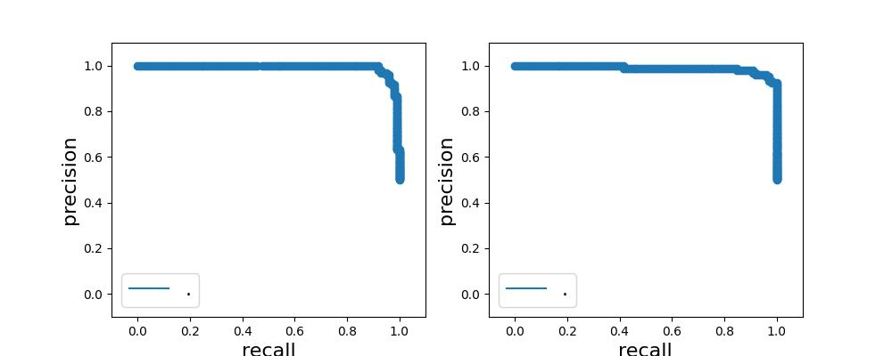
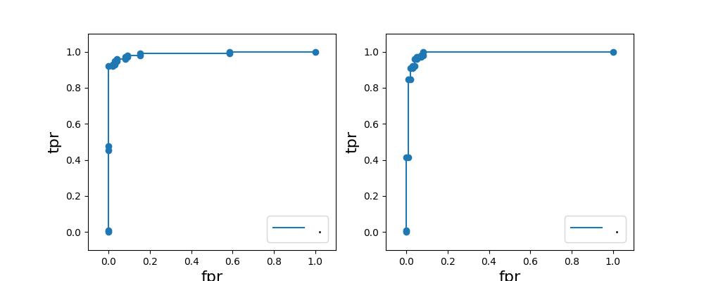
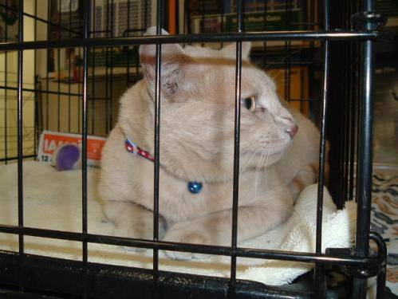
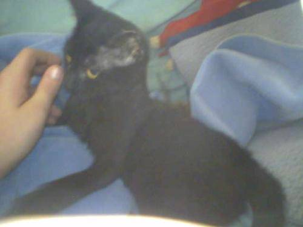

# Preface
This is a template repository for **`N-class classification problem`** based on Pytorch. The example dataset is from [here](https://drive.google.com/file/d/1ADEaQc6WyTVgWN-SZhpUgHchDGZDmY20/view?usp=sharing), which is sample from [Kaggle_cats_dogs_dataset](https://www.kaggle.com/datasets/tongpython/cat-and-dog) and gained one noise class.

# Prerequisites
### Software
+ Install python 3.9.12. Download [here](https://docs.conda.io/projects/miniconda/en/latest/).
+ Install packages
```
pip install -r requirements.txt 
```
+ Install pytorch alongside gpu
```
pip install torch==1.9.0+cu111 torchvision==0.10.0+cu111 torchaudio==0.9.0 -f https://download.pytorch.org/whl/torch_stable.html
```
### Hardware
+ ResNet50 (25M parameters), GPU momory >= 4GB is guaranteed work

# File structure
+ _data/catdog_simple/ # dataset
	+ training_set/training_set/
    	+ cats/*.jpg
    	+ dogs/*.jpg
	+ test_set/test_set/
    	+ cats/*.jpg
    	+ dogs/*.jpg 
+ main.py # modes include train, valid, infer
+ utils.py # common utilities e.g. dataset, model, plot, etc. 
+ results/ # auto-generated when executing main.py
    + exp1/
        + *_args.json # arguments
        + *_pred.csv # prediction results
        + *.jpg # result curve
        + *.pt # trained model weights
        + history_*.json # training history

# Quick start
### 3 modes share same script: train / valid / infer
```
python main.py [--options]
```
+ \--mode: Be 'train' or 'valid' or 'infer'
+ \--output-dim: Number of classes, but it can be either 1 or 2 for binary classification. 
+ \--resume: when mode='valid' or 'infer', this model path should be specified
+ See all arguments in main.py

# Pipeline
The code will be executed in the following steps:
+ Global setting
	+ Set random seed
	+ Make result folder
	+ Save `args_{mode}.json` at the result folder
	+ Check GPU and set device
+ Dataset
	+ Customized part for preparing:
		+ train_path: list[str]. path of each training data
		+ valid_path: list[str]. path of each validation data
		+ train_label: list[int]. class index of each data in train_path
		+ valid_label: list[int]. class index of each data in valid_path
	+ Generate loaders according to the above variables
	+ Compute loss weights from harmonic mean of each class samples
+ Model
	+ Get model
	+ Resume checkpoint
	+ To GPU
+ Loss function
	+ Get loss function (compute mean only when args.mode=='train')
	+ To GPU
+ Optimizer
	+ Get optmizer and lr_scheduler
+ Core
	+ Grad loop (Train only)
		+ Standard
		+ Collect all prediction as shape (N, classes)
		+ Compute F1, APs, mAP, cls_report
	+ Non-grad loop
		+ Standard
		+ Collect all loss as shape (N,)
		+ Collect all prediction as shape (N, classes)
		+ Compute F1, APs, mAP, cls_report
	+ More actions when epoch ends:
		+ if **mode=train**:
		    + Save best mAP checkpoint as `model.pt`
		    + Save `history_train.json`
		+ if **mode=valid**:
		    + Save `history_valid.json`
		    + Compute AUC and specificity
		    + Compute confusion, then save top-N loss of each false classified images in `confusion/gt_{cls-a}_pd{cls-b}/*.jpg`
		+ if **mode=infer**:
		    + Export top-N unconfident images to `worst_imgs/*.jpg`
+ Saving prediction results into `pred_{mode}.csv`
+ Plotting
	+ if **mode=train**:
	    + `curve_loss_f1_map.jpg`: epoch x loss, epoch x f1, epoch x map
	+ if **mode=valid**:
	    + `curve_prf.jpg`: threshold x (precision, recall, f1)  
        + `curve_pr.jpg`
        + `curve_roc.jpg`

# Features
+ As **precise** and **comprehensive** as possible
+ Feel free to contact me if you have any question. Thanks.

# Results
### mode = train
+ plots in all class average


### mode = valid
+ plots for each class (left:class-0, right:class-1)



+ default_threshold = 0.5

| AP 0  | AP 1  | f1 0 | f1 1 | precision 0 | precision 1 | recall 0 | recall 1 | mAUC  |
| -     | -     | -    | -    | -           | -           | -        | -        | -     | 
| 0.992 | 0.986 | 0.95 | 0.94 | 0.93        | 0.96        | 0.96     | 0.93     | 0.989 |

|      | PD=0 | PD=1 |
| -    | -    | -    |
| GT=0 | 95   | 4    |
| GT=1 | 7    | 92   |

+ best_threshold = 0.1 (best f1 threshold optimization)

| AP 0  | AP 1  | f1 0 | f1 1 | precision 0 | precision 1 | recall 0 | recall 1 | mAUC  |
| -     | -     | -    | -    | -           | -           | -        | -        | -     | 
| 0.992 | 0.986 | 0.96 | 0.96 | 1.00        | 0.93        | 0.92     | 1.00     | 0.989 |

|      | PD=0 | PD=1 |
| -    | -    | -    |
| GT=0 | 91   | 8    |
| GT=1 | 0    | 99   |

+ prediction e.g. pred_valid.csv

| data                           | label | pred_probs_all |
| -                              | -     | -              | 
| .../test_set/cats/cat.4001.jpg | 0     | (0.998, 0.002) |
| ...                            | ...   | ...            |
| .../test_set/dogs/dog.4099.jpg | 1     | (0.007, 0.993) |

+ visualization of false classified images


cat.4008.jpg. The difficulty might be the cage.
p(cats)=0.807, p(dogs)=0.193, but the best threshold = 0.10

### mode = infer
+ visualization of the most unconfident data


cat.4087.jpg. The difficulty might be the vague.
p(cats)=0.415, p(dogs)=0.585